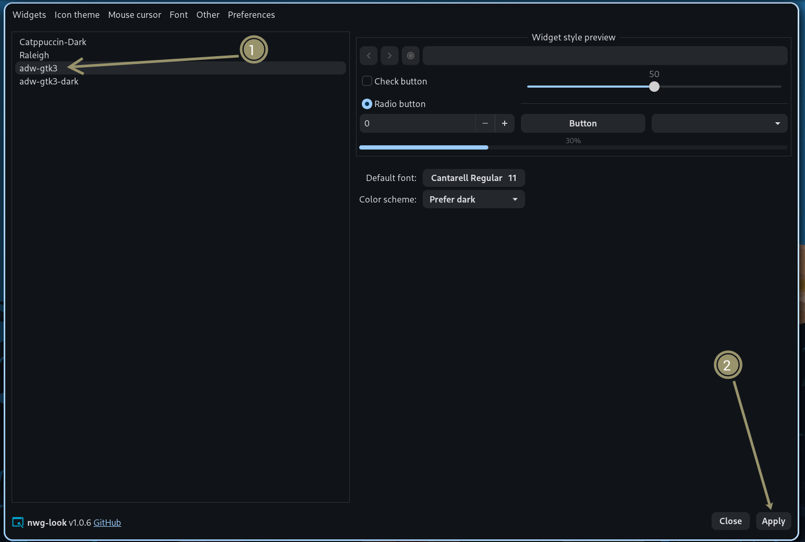

import { Tabs, TabItem } from '@astrojs/starlight/components';

This guide covers theming applications built with GTK, Qt, and KDE Plasma toolkits.

## GTK 3/4 Applications

GTK applications include most GNOME apps and many Linux applications. Noctalia can automatically theme them using the `adw-gtk3` theme.

### Setup

1. **Install required packages:**
   ```bash
   # Arch Linux / Manjaro
   paru -S adw-gtk-theme nwg-look
   
   # Other distributions
   # Install adw-gtk-theme and nwg-look from your package manager
   ```

2. **Apply the GTK theme:**
   - **Using nwg-look (recommended):**
      :::tip[GTK4 Theming]
      In nwg-look, make sure to **uncheck the GTK4 option**. Leaving GTK4 checked can prevent GTK4 applications from using Noctalia's color scheme.

      If you previously applied a custom GTK4 theme, you may need to hit **"Clear"** (found in the **Preference** tab) in nwg-look before reapplying and regenerating the color scheme. This ensures the new colors are accepted by GTK4 apps.
      :::
      - Open `nwg-look`
      - Select `adw-gtk3` from the theme list
      - Click "Apply"
      - 
   
  - **Using command line:**
     ```bash
     gsettings set org.gnome.desktop.interface gtk-theme 'adw-gtk3'
     ```

3. **Enable GTK theming in Noctalia:**
  - Open **Settings → Templates**
  - Toggle on **GTK 3** and/or **GTK 4**

Enabling those built-in templates writes `noctalia.css` and runs the shipped
[`apply.sh`](https://github.com/noctalia-dev/noctalia/blob/main/assets/templates/gtk/apply.sh)
`post_hook` (`bash '…/gtk/apply.sh' dark|light`). That script imports
`noctalia.css` into `gtk.css` and syncs `adw-gtk3` / `adw-gtk3-dark` plus
`org.gnome.desktop.interface.color-scheme`. A theme mode change re-applies the
templates, so the same full hook runs again — you do not need a separate hook
for that path.

### Optional: appearance sync without GTK templates

If you are **not** using the GTK templates but still want GNOME’s
`color-scheme` preference updated on dark/light switches, add a
[`theme_mode_changed`](/noctalia/automation/hooks/) hook with `--appearance-only`
(skips the CSS import and does not change `gtk-theme`):

```toml
[hooks]
theme_mode_changed = "/usr/share/noctalia/assets/templates/gtk/apply.sh --appearance-only $NOCTALIA_THEME_MODE"
```

Use `/usr/local/share/noctalia/...` instead if you installed with Meson’s default prefix.
`$NOCTALIA_THEME_MODE` is set by the hook (`dark` or `light`). Switching
`color-scheme` can flash some apps (browsers especially); keep this opt-in.

### Troubleshooting

- **Theme not applying:** Completely restart GTK applications (close and reopen)
- **Some apps still look wrong:** Some GTK apps may need GTK 4 theme separately:
  ```bash
  gsettings set org.gnome.desktop.interface gtk-theme 'adw-gtk3'
  gsettings set org.gnome.desktop.interface color-scheme 'prefer-dark'  # or 'prefer-light'
  ```
- **Flatpak apps:** Flatpak apps may need the theme installed in their sandbox:
  ```bash
  flatpak install org.gtk.Gtk3theme.adw-gtk3-dark
  flatpak install org.gtk.Gtk3theme.adw-gtk3
  ```

---

## Qt Applications

Qt applications include KDE apps and many cross-platform applications. KDE apps (Dolphin, KDE Connect) require the use of a KColorScheme, and so this is the preferred way to theme QT applications. Use of a normal QT theme instead of a KColorScheme can cause colors to appear incorrectly or unreadable when running KDE apps. If KDE apps are not used, then the normal QT theme can be used instead.

### Setup

1. **Install an application that allows you to apply QT/KColorScheme themes:**
   While the setup steps will go through the process of using `qt6ct-kde`, there are multiple options available.
   
   - **qt6ct** (`qt6ct-kde` with the KDE patches)
     ```bash
     # Arch Linux / Manjaro / CachyOS
     paru -S qt6ct-kde
     ```
   - **qtengine** (https://github.com/kossLAN/qtengine)
   - **hyprqt6engine** (https://github.com/hyprwm/hyprqt6engine)

2. **Set environment variable:**
   Add this to your window manager configuration or shell profile:
   
   **For Niri (`config.kdl`):**
   ```kdl
   environment {
     QT_QPA_PLATFORMTHEME "qt6ct"
   }
   ```
   
   **For Hyprland:**
  <Tabs>
    <TabItem label="hyprland.conf ( 0.54.* and earlier)">
     ```ini
     env = QT_QPA_PLATFORMTHEME,qt6ct
     ```
   </TabItem>
     <TabItem label="hyprland.lua ( 0.55.* and later)">
     ```lua
     hl.env("QT_QPA_PLATFORMTHEME", "qt6ct")
     ```
     </TabItem>
  </Tabs>
   
   **For Sway (`config`):**
   ```bash
   setenv QT_QPA_PLATFORMTHEME qt6ct
   ```
   
   **For shell profile (`~/.bashrc` or `~/.zshrc`):**
   ```bash
   export QT_QPA_PLATFORMTHEME=qt6ct
   ```

3. **Enable the KColorScheme (or QT theme) in Noctalia:**
  - Open **Settings → Templates**
  - Toggle on **KColorScheme** (or **Qt**)

4. **Configure qt6ct:**
  - Run `qt6ct` from terminal
  - In the **Appearance** tab, there will be a dropdown for **"Color scheme:"**
  - In the dropdown select `noctalia (KColorScheme)` if using a KColorScheme for KDE app compatibility, or `noctalia` for a normal QT theme without the need for KDE app compatibility.
  - Click **Apply** and **OK**
   
   :::tip[KDE File Picker]
   If you use the KDE file picker, go to the **Settings** tab in `qt6ct` and set **Standard dialogs** to **KDE** (note that this needs plasma-workspace to be installed to appear as a dropdown option)..
   :::

### Troubleshooting

- **Qt apps not themed:** Ensure the environment variable is set before launching applications
- **qt6ct not found:** Make sure qt6ct is installed and in your PATH
- **Theme not updating:** Restart Qt applications after changing color schemes
- **"The application is not configured correctly":** If opening qt6ct states this, it is likely that the `QT_QPA_PLATFORMTHEME` environment variable is not correctly set to `qt6ct` (Note: This may require a reboot if you set it for the first time).

---

## KDE Plasma (KColorScheme)

If you're using KDE Plasma, Noctalia can apply colors through the native KColorScheme system.

### Setup

1. **Enable KColorScheme in Noctalia:**
  - Open **Settings → Templates**
  - Toggle on **KColorScheme**

2. **Apply in KDE System Settings:**
  - Open **System Settings → Appearance → Colors**
  - Select the `noctalia` color scheme
  - The scheme will update automatically when you change colors in Noctalia

### Troubleshooting

- **Scheme not appearing:** Restart KDE Plasma or log out and back in
- **Colors not updating:** Ensure KColorScheme toggle is enabled in Noctalia settings
